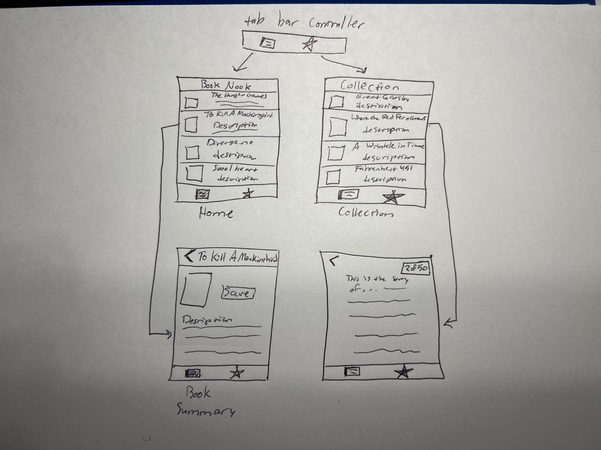

Original App Design Project - README
===

# BookNook

## Table of Contents

1. [Overview](#Overview)
2. [Product Spec](#Product-Spec)
3. [Wireframes](#Wireframes)
4. [Challenges](#Challenges)

## Overview

### Description

BookNook is a book reading and collecting app that allows you to manage your books, see new available books by category, create your own collection, read through pages, and keep track of your book marks.

### Video Walkthrough

### App Evaluation

- **Category:** Entertainment
- **Mobile:** Mobile is great for those who want to read on-the-go or don't have access to a computer. They can read while waiting in line or even when they want to snuggle up under a banket in bed with any weird position they want.
- **Story:** Creates an easily accessible way for book readers to start or finish their favorite books on the go.
- **Market:** Any individual could use this app, from a college student trying to catch up on his text book before class or a parent trying to pass the time during their kid's soccer game.
- **Habit:** People use this constantly to find new stories and continue reading the ones they've saved.
- **Scope:** V1 would allow users to see a list of books and save it to their own collection. V2 would allow users to open and read a book. V3 would allow users to bookmark pages. 

## Product Spec

### 1. User Stories (Required and Optional)

**Required Must-have Stories**

* User can view a list of books
* User can view a description and cover of a book
* User can save books to their collection
* User can view saved books in their collection
* User can open and view pages of a book

**Optional Nice-to-have Stories**

* User can bookmark the page they left off from in their book
* Animation to flip pages in a book
* User can view books by category
* User can view what number page they're on

### 2. Screen Archetypes

- [ ] Home
* User can view a list of books
* User can view books by category
- [ ] Book Summary
* User can view a description and cover of a book
* User can save books to their collection
- [ ] Page
* User can view pages of a book
* User can see what number page they're on
* User can bookmark the page they left off from in their book
* Animation to flip pages in a book
- [ ] Collection
* User can view their saved books

### 3. Navigation

**Tab Navigation** (Tab to Screen)

* Home Feed
* Saved

**Flow Navigation** (Screen to Screen)

- [ ] Home
* => Book Summary
- [ ] Book Summary
* => None
- [ ] Collection
* => Page (After selecting a book, you go to the last bookmarked page)
- [ ] Page
* => Another Page or None

## Wireframes

## Challenges 

* JSON Decoding wasn't working at first because I realized later that I was using a property that only shows on some books of the Google Books API  but not all books

* I didn't know how to install Swift packages, so downloading Nuke was a struggle

* For some reason, the latest version of Nuke doesn't support the "loadImage()" function, so I spent a lot of time researching before just downloading the version of Nuke that we used in the past homework

* I was getting an error when trying to load images about connection security, and had to change the App security protocols to allow loading of larger images.

## Implemented User Features / Progress

- [X] User can view a list of books
- [X] User can view a description and cover of a book
- [X] User can save books to their collection
- [X] User can view saved books in their collection
- [X] User can open and view pages of a book